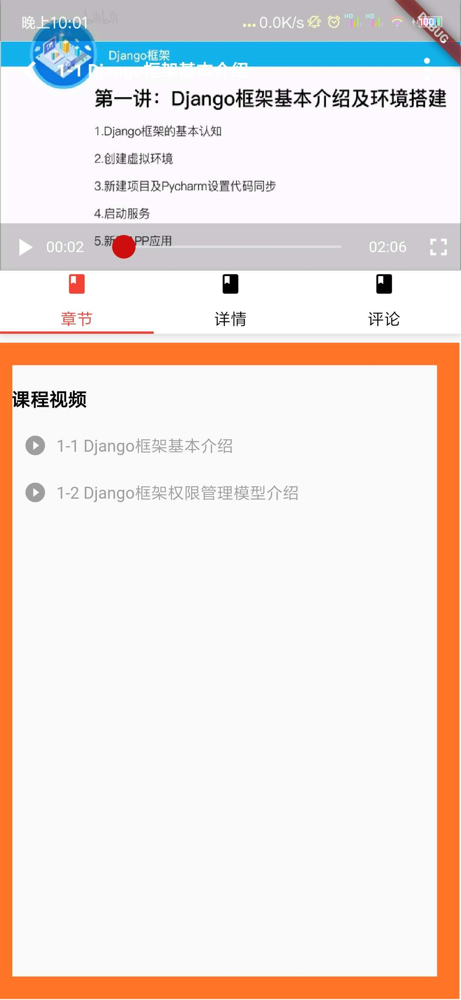

## 易教育App —— flutter开发的简单在线教育平台安卓客户端

ps：边开发边学习，功能仍在完善当中...

## 简单架构相关

### flutter app简单架构考虑
#### 1. 简述
> 部分后台接口json数据 转 dart model格式; <br/> 全局变量配置文件；<br/> 共享状态数据配置文件； <br/> 数据持久化实现； <br/> 全局错误捕获和上传日志；  
> app页面架构：页面Widget，封装复用功能Widget，封装跨组件共享的State类

#### 2. 页面管理
   页面架构:
   - 骨架页面；FramePage.dart，包含顶部导航栏、搜索框、底部tab菜单（四个切换页面按钮）用于切换四个TabView页面
   - 四个Tabview页面；首页、分类页、我的学习、个人中心，存储与TabView文件夹
   - 其他独立页面，包括启动页面、登录注册相关页面、其他功能页面
   - 页面Widget封装、复用:存储在Widget文件夹
   - 页面路由跳转：使用官方提供的api
<br/>

#### 3. 数据管理相关

 - 数据持久化、状态共享——简述
>  共享状态 —— app部分数据在所有组件之间的共享
> 数据持久化 —— 部分数据需要在用户手动清除前进行持久化存储在本地
> 共享与持久化关系：持久化同时又需要共享的数据：数据更新，调用共享状态方法，同时进行持久化存储。
- 数据持久化、状态共享——实现方案
> common文件夹下封装通用方法类：
  > - 全局变量Global类：保存全局变量信息，信息数据属性、数据持久化相关方法--静态方法，方便使用，app载入数据初始化，但是对于数据修改需要触发多个页面的ui更新的还是使用状态共享合适。这里是作为一个app整体的部分全局数据、方法的管控以及app每次重新载入的数据初始化：登录用户信息等是否缓存，是:登录状态，否：非登录状态
  > - 状态共享管理 :  `实现方案(Provider)` 管控app全局状态共享，只要是相关的状态共享就需要它，比如登录状态，调用它对应类内部封装属性或方法判断，状态更新调用它对应类内部封装的方法进行更新。跨页面状态共享的地方使用它来获取对应的状态实现多个地方的状态共享，及时更新信息。（app内部状态共享：所有组件共享，使用和修改都需要调用相关的方法），采用方案是全局变量(登录用户信息类，账号信息类、数据信息持久化相关方法（增、删）)
  > 关系：全局变量Global提供载入app的数据初始化以及为Provider相关管控类提供部分数据封装类入User类。provide负责 实现App状态共享，维护需要全局状态共享的数据：提供修改和获取等相关方法
  - 应用
  ```dart
   // 退出登录，调用封装的全局静态方法清除持久化的用户信息
        Global.clearUser();
  // 使用provide更新状态，通知其他页面
        User user1 = Global.user;
        user1.userInfo = null;
        userModel.changeUserInfo(user1);
  ```
- app入口初始化信息后再构建app视图等
 ```dart
 void main() => Global.init().then((e) => runApp(MyApp()));
 ```

#### 4. 网络请求相关
 - 数据层  json -> dart Model类
 > 根据后台接口相关的实体类的json数据，生成相对应的Dart Model类，方便我们获取后台数据后进行对数据业务逻辑的操作，使用这种方式不容易出错
 > 补充:每一个实体类json，我们可以生成一个对应的Dart Model类
 > 补充：对于涉及用户账号信息、登录状态、用户设备app配置信息等需要进行持久化，此时我们至少需要建立两个关联的json文件来生成对于的Dart Model类
 >如本项目例子: `user.json` 与 `userInfo.json`
> `userInfo.json`对于后台接口的用户账号信息，`user.json`则对应我们本设备app用户登录状态、app配置相关信息，如下

- `userInfo.json`
```json
{
    "stuid": "ST20191205001",
    "roleId": 3,
    "petname": "宏野鬼眼",
    "stuname": "杰克",
    "stupassword": "123456",
    "stusex": "男",
    "stuage": 18,
    "birthday": null,
    "role": null,
    "phone": "13454454554",
    "email": "1143134444@qq.com",
    "qq": "1143134444",
    "registertime": 1575705233000,
    "address": "暂无信息",
    "stuintroduce": "暂无信息",
    "integral": null,
    "state": 0
  }
```
- `user.json`
```json
{
    "userInfo":"$userInfo",
    "theme":"user's app theme",
    "brightnessStyle":"brightnessStyle"
}
```
应用，调用后台接口可获取到用户账号信息也就是userInfo信息
```dart
 var userInfo1 =  new UserInfo.fromJson(uInfo);
 print(userInfo1.petname);
```
- flutter网络请求插件——Dio
> http.dart封装基于Dio的两个请求方法——get、post，通过回调函数监听请求成功和失败将其暴露出来

#### 5. flutter 错误捕获和生成日志

实现方式，main入口函数初始化app的时候加入
```dart

void collectLog(String line){
    // ... //收集日志
    print(line)
}
void reportErrorAndLog(FlutterErrorDetails details){
    // ... //上报错误和日志逻辑
    print(details);
}

FlutterErrorDetails makeDetails(Object obj, StackTrace stack){
    // ...// 构建错误信息
}

// 使用assert 来区分生产环境和开放环境
bool get isInDebugMode {
  // Assume you're in production mode.
  bool inDebugMode = false;

  //assert只有在开发环境才有效，生产环境这句代码会被忽略
  assert(inDebugMode = true);

  return inDebugMode;
}

void main() {

FlutterError.onError = (FlutterErrorDetails details) {
  
  if (isInDebugMode) {
      // debug模式直接打印在控制台 
      
      FlutterError.dumpErrorToConsole(details);
    } else {
      // 在生产模式下,重定向到 runZone 中处理
      
      Zone.current.handleUncaughtError(details.exception, details.stack);
    }
    reportErrorAndLog(details);
  };

  runZoned(
    () => Global.init().then((e) => runApp(ChangeNotifierProvider<UserModel>.value(
          notifier: UserModel(),
          child: MyApp(),
        ))),
    zoneSpecification: ZoneSpecification(
      print: (Zone self, ZoneDelegate parent, Zone zone, String line) {
        collectLog(line); //手机日志
      },
    ),
    onError: (Object obj, StackTrace stack) {
      var details = makeDetails(obj, stack);
      reportErrorAndLog(details);
    },
  );


}
```

## 功能模块和设计相关

### 功能模块
> 主模块分为首页、分类、订单支付、视频详情、视频课程播放、个人中心、课程搜索和展示

### 功能设计和实现
 - 在基础框架搭建完毕的基础上实现页面和数据交互等相关业务逻辑
 - 部分说明如下
 > 1. 使用 Flutter 基本语法进行布局，并封装了一系列通用的组件，比如 商品列表box、图文布局box，通用列表组件、星级点赞组件、加载状态组件，等，便于全局复用
 >2. 搜索课程展示，使用SliverAppBar，增加交互动效，提高用户体验。
 >3. 扩展列表组件，结合 NotificationManager 实现上拉加载更多数据，下拉刷新数据。
 > 4. 使用 staggered_grid_view、ListView 组件展示图文列表。
 > 5. 使用 Provider 状态管理，实现部分数据state统一管理，跨多个页面共享状态，响应式触发ui更新。如用户退出登录，触发多个使用登录状态的页面ui发生改变。
 > 6. 使用`image_picker`实现从相册选择图片和使用相机拍照
 > 7. 使用`flutter_alipay`实现唤起手机端支付宝支付
 > 8. 使用`fijkplayer`自定义视频播放ui界面以及视频播放功能。
    

## 简单记录flutter开发经验
### 开发环境
> 在vscode下进行开发和调试，使用vscode调试工具开启hot load模式，便于保存试试更新方便调试

### flutter本身理解：构建页面的Widget + 数据状态
> 无状态Widget无需数据交互，带状态的Widge需要数据交互等相关业务逻辑，数据驱动不同Widget构建的ui进行更新
### flutter组件化、模块化思维：
> 封装通用组件复用，创建代码模板提高开发效率
### flutter社区：
> flutter官方以及第三方提供不少开源的精美ui组件和相关的功能pub包如状态管理的Provider，网络请求的dio，支付宝支付flutter_alipay等等。
### 标签
`flutter组件Widget——局部组件的、构建功能组件的、构建完整页面脚手架等到`、`flutter使用Widget实现布局`、`flutter异步`、`flutter状态共享`、`flutter 数据持久化`


### 简单开发过程相关

####  第三方接口相关
- 微信登录
- 微信支付[参考](https://zhuanlan.zhihu.com/p/68971736)[参考](https://www.jianshu.com/p/2c9ca9a1b708)
  1. 微信支付流程——客户端、后台接口
  流程简述：客户端收集用户填写的订单表单相关信息，通过后台开发的接口将订单参数传给后台，后台调用微信统一下单接口，获得预支付订单id(prepayid)，签名sign，后将这些参数返回给客户端
    ```java
    // 相关接口参数
    params.put("appid", Const.APP_ID);//App ID
    params.put("body", "Test Goods");//商品名称
    params.put("mch_id", Const.MCH_ID);//商户号
    params.put("nonce_str", WXPayUtil.generateNonceStr());//随机字符串
    params.put("notify_url", Const.NOTIFY_URL);//支付结果回调地址
    params.put("out_trade_no", WXPayUtil.generateUUID());//订单号
    params.put("spbill_create_ip", "127.0.0.1");//  用户端实际ip
    params.put("total_fee", "1");//金额
    params.put("trade_type", "APP");//支付类型
    params.put("sign", sign(params));//签名
    ```
   后台调用统一下单接口成功后，将获取到的参数返回给客户端，供客户端唤起微信支付，主要包括下面的流程：
   - 初始化（注册）支付sdk--需要参数appId
   - 调用支付接口，传入后台穿过来的那些参数，如下：
   ```dart
    appId: res['appid'],
    partnerId: res['partnerid'],
    prepayId: res['prepay_id'],
    packageValue: res['package'],
    nonceStr: res['nonce_str'],
    timeStamp:  res['timestamp'],
    sign: res['sign'],
    signType: '',
    extData: ''
   ```
   监听支付结果,通过状态码判断支付成功还是失败
    

2. 微信支付需要去微信开放平台申请获取以下参数的信息
   >- App ID：在微信开放平台创建应用，配置应用包名和签名(确保签名与你app运行时的签名一致，可以通过app的包名利用工具来获取)
   >- API KEY: 微信商户平台设置
   >- 商户号: 微信商户平台商户号
3. 具体的申请流程   
```
微信开放平台 申请账号，
创建移动应用（Android的应用签名后面可以修改，只要你能保证你release的包签名跟这里填的一致即可. 签名获取:Gen_Signature_Android2）。
审核通过后就有了AppID
开发者资质认证，通过后申请支付权限
开通支付后续会引导你注册一个商户账号, 也就是微信支付-商户平台
商户ID 账户中心-个人信息-账号信息-登录账号
API密钥 账户中心-账户设置-API安全-设置API密钥
```

4. 开发案例
   - 存储卡、信用卡、记账管理app：外包项目，当时甲方公司运营人员去微信开放平台注册，申请，我负责提供app包名和app签名。通过审核后他们将appid等我需要的相关信息发给我，我负责和后台配合，实现微信支付的功能。[官网](http://al16346814.jz.fkw.com/)
   - 此项目：此项目使用flutter开发，微信支付sdk打算使用fluwx，但是由于申请微信开放平台貌似还是没有针对个体用户开放，申请过程还是需要填写企业认证相关信息，加上时间也不够了，后台小伙伴也没有打算对接微信支付，所以就没有实现微信支付

- 支付宝支付


 支付宝的支付把很多重要的数据都是放在服务器后端的，所以服务器端操作比较繁琐，需要集成sdk，调用sdk相关接口等到，这里(fluter)客户端支付宝支付(安装支付宝flutter支付插件，不需要像安卓那样下载集成sdk)的代码就相对比较少，关键是下面两部(本项目使用的是支付宝沙箱环境)
  
  1. 安装  `flutter_alipay` 插件 [文档](https://pub.dev/packages/flutter_alipay)
   ```yaml
    flutter_alipay: ^0.1.0
   ```
   2. 根据用户下单参数调后台生成订单接口，获取支付包支付签名sign(用于在客户端调起支付宝支付)，下面是相关代码
   ```dart

   // 调用后台接口，获取相关数据
   DataUtils.payByAli(params).then((value) {
        if (value != null) {
          print('   ALiVVVVVV $value');

          var jsData = json.decode(value);
          int status = jsData['status'];
          String msg = jsData['msg'];
          if (status == Constant.SUCCESS_CODE) {
            AliPaySignBean aliPaySignBean =
            AliPaySignBean.fromJson(jsonDecode(value));
            AliPaySignInfo signInfo = aliPaySignBean.data.info;
            String sign = signInfo.sign;
            // 使用sign调起支付宝
            aliPay(sign);
          } else {
            Util.showToast(msg);
          }
        }
      }).catchError((e) {
        print(' ## $e');
      });

    // aliPay（）这个接口通过传入的sign调起支付宝支付，代码如下：  
      void aliPay(String sign) async {
    if (sign == null || sign.length == 0) {
      return;
    }
    FlutterAlipay.pay(
      sign,
      urlScheme: '你的ios urlScheme', //前面配置的urlScheme
       isSandbox: true //是否是沙箱环境，只对android有效
    ).then((payResult){
      _payResult = payResult;
      print('>>>>>  ${_payResult.toString()}');

      String payResultStatus = _payResult.resultStatus;
      if (payResultStatus == Constant.ALIPAY_SUCCESS) {
        payState = true;
        Util.showToast('支付成功');
      } else if (payResultStatus == Constant.ALIPAY_CANCLE) {
        payState = false;
        Util.showToast('支付取消');
      } else if (payResultStatus == Constant.ALIPAY_FAILE) {
        payState = false;
        Util.showToast('支付失败');
      } else if (payResultStatus == Constant.ALIPAY_WAITTING) {
        payState = false;
        Util.showToast('等待支付');
      } else if (payResultStatus == Constant.ALIPAY_NET_ERROR) {
        payState = false;
        Util.showToast('无网络');
      } else if (payResultStatus == Constant.ALIPAY_REPET) {
        payState = false;
        Util.showToast('重复支付');
      }
      jump2PayForCourseDetail();
      if (!mounted) return;
      setState(() {});
    }).catchError((e){
      _payResult = null;
      payState = false;
      Util.showToast('支付失败');
    });
  }
   ```
  
  ### 项目业务逻辑等开发相关

  #### 1. 视频播放相关业务
  
  - 自定义视频播放器ui界面——根据项目自定义ui界面需求，基于第三方flutter 视频播放插件封装了一个flutter视频播放器提供项目使用[地址](link)

  <br/>

  - 视频播放器开发：

  需求与难点
  1.1 flutter第三方的视频播放插件比较少，支持自定义ui界面的更是很少，而第三方插件中没有找到可以满足自己的视频播放界面需求的一款插件
  1.2 视频播放ui界面自定义，也就是的播放视频逻辑借助第三方播放插件，而相关的ui界面全部由你自己来实现，需要考虑播放器界面的尺寸，ui控件（包括播放暂替开始按钮、进度条、全屏按钮、标题栏、其他功能按钮）需要响应式改变布局,主要是视频全屏非全屏切换的时候，视频界面上方的控件要响应式布局，保证布局不错乱
  1.3 视频播放控件的所有功能需要自己调接口封装比如播放按钮的播放切换、进度条切花进度，全屏切换、手势控制播放视频，比如双击暂停，向上向下改变音量、亮度等等。
  1.4 视频全屏的时候，播放器界面类重置了，导致部分数据属性也重置了无法监听到视频切换全屏事件

  解决
  1.1 使用`FijkPlayer`插件提供视频播放器底层的相关接口之外，还支持自定义视频播放器ui
  1.2 播放器界面尺寸自适应和控件布局自适应解决方案是； 播放界面的宽度；始终定义为最大尺寸也就是沾满全屏，而宽度部分的控件比如底控件栏如果采用使futter弹性布局，使布局其自适应全屏和非全屏
  1.3 视频界面高度比较方便的解决方案，视频全屏的时候，设备的宽度既是视频界面的高度，所以可以一开始获取设备的宽度来设置视频的高度，这样切换视频全屏非全屏可以整体实现布局的响应式无需要再额外监听全屏再单独设置样式
  1.4 无法监听视频全屏事件，导致可能出现部分错误无法及时处理，此时采用折中方案进入全屏捕获到错误的时候，暂停播放，提示用户重新点击播放按钮，即可恢复。


  - 视频播放页面组合构成的难点： 
  > 视频播放器 + flutter tab切换下方显示不同的组件内容（评论、详情、章节），如下图红色部分

  

  > 难点说明，使用flutter的TabBar组件来实现视频播放页面的tab切换，就类似一点b站那样的页面，但是问题是flutter提供两种使用Tabar方式，如果是是使用自定义controler方式，你可以监听到TabBar切换，以便在用户切换tab的时候做处理，但问题是这种方式只能切换整个完整的页面，而且tab菜单的位置无法自定义，也就是没有办法让它位于视频播放器的底部。所以我采用了`DefaultTabController`,它可以自定义tab菜单栏位置。当然肯定还有更好的解决方案只是由于时间问题我没有再去深入研究，加上自己主要方向还web前端开方。使用`DefaultTabController`可以使得tab菜单由于我们视频播放器器下面，同时可以不采用默认的切换整个页面，只是点击不同的tab按钮，就在下面局部更新组件，类似b站视频播放非全屏的页面。所以我必须监听每一个tab的切换，点了那一个我根据他的索引为他显示对应的组件布局。单 此时一个问题是`DefaultTabController`我无法监听tab的切换，比如用户一开始显示章节部分后面他点击了详情按钮，但是此时我无法监听到，也就是无法在下方显示详情组件。此时一个折中的方法是在每一个tab的配置参数那里的icon 属性加入一个手势事件，监听点击，最终实现点击切换下面的显示不同的组件。


- 解决Flutter出bug的时候直接在页面显示红屏的异常??
> Flutter出现bug的时候不是直接闪退而是直接在页面显然红色异常，要是上线的话，对用户体验来说比之际闪退还差，于是上线的生产环境需要解决flutter的这个问题
> 使用flutter开发部署上线的时候的时候虽然可以使用相关方法进行错误捕获上传，代替默认出错打印到控制的行为，但是无法取消flutter出某些bug的时候直接显示红色信息到当前页面，查阅相关资料后发现该行为产生的原因如下：

> Flutter 框架为我们在很多关键的方法进行了异常捕获，比如当我们布局发生越界或不和规范时，Flutter就会在当前页面自动覆盖一个错误界面，没错这就是那个很不美观的红色异常，而实现这一点是因为Flutter已经在执行build方法时添加了异常捕获，最终的源码如下：
```dart
@override
void performRebuild() {
 ...
  try {
    //无隐藏执行build方法，显示我们正常页面  
    built = build();
  } catch (e, stack) {
    // 有异常时则显示`ErrorWidget.builder(_debugReportException('building $this', e, stack))`返回的错误提示组件 
    built = ErrorWidget.builder(_debugReportException('building $this', e, stack));
  } 
  ...
} 
```
所以要想不要显示红色隐藏，只要重写` ErrorWidget.builder `方法即可
```dart
 ErrorWidget.builder = (FlutterErrorDetails flutterErrorDetails){
    print(flutterErrorDetails.toString());
    return Center(
      child: Text("请重新加载"),
    );
  };
```


#### 2. 复杂布局和数据处理更新ui


 


